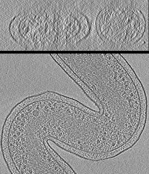
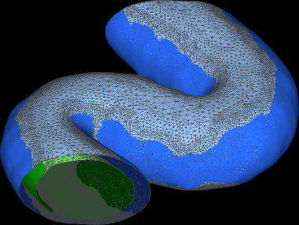
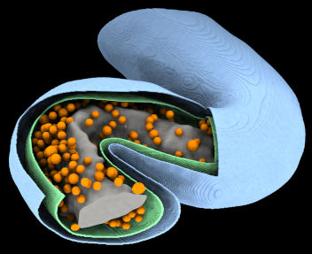

Hylemonella gracilis example
============================

        

This directory contains instructions for segmenting a relatively simple tomogram
of Hylemonella gracilis.  This species of bacteria is quite thin, an this
makes it possible to obtain high quality tomograms with a high ratio
of signal-to-noise.  Unlike many bacterial tomograms, in this species
it is normal to be able to see ribosomes and nucleoids and other interior
features inside the cell which are difficult to see in thicker specimens.

### (Terminology: "3D image")

In these instructions, I use "tomogram" and "3D image" interchangeably.

# Overview

The segmentation process is divided into multiple steps.
The details of these steps are provided in different files included
in this directory.

We will proceed with segmentation of the cell, starting from the outside
and moving inward.

## STEP_1
I provide instructions where to find the tomogram we will use in this example,
and how to crop it to a reasonable size.  (Full size tomograms
are hard to work with.)

## STEP_2
Some users prefer to clean up the source tomogram using NAD filtering.
This is optional.  The instructions in STEP_1 explain how to do that
for those who are interested.
(However it was not necessary in this example.)

## STEP_3
This sample contains gold fiducial beads which appear as extremely dark
black spots in the tomogram.  First we must get rid of these voxels and
remove them from consideration (by creating a "mask" file which excludes them).

## STEP_4
The next step is to determine the location of all of the membranes in the
image, and determine which voxels like within the membrane-bound compartments.
For this tomogram, this includes the inner and outer membrane of the bacteria.
*(In this nice and clean tomogram, it is relatively easy to detect the
membranes directly.  For other tomograms, additional processing may be needed to
clean up or enhance the image beforehand.)*

## STEP_5
Many bacterial tomograms contain poly-phosphate-bodies (PPBs), which usually
appear as large dark spherical blobs in the tomogram.  They can usually be
detected and segmented automatically by "filter_mrc" using the standard
"blob detection" method.  But in this example, there was only one tiny
PPB in the tomogram.  The "filter_mrc" program confused it with the
ribosomes in the cell because they are both similar in size.
So instead I provided instructions how to segment this small PPB manually.

## STEP_6
Many bacterial tomograms also contain storage granules.  However this tomogram
did not.  So I provided instructions how to create a blank 3D image.
*(This blank 3D image lets the "filter_mrc" segmentation software know
that there were no storage granules present in this tomogram.)*

## STEP_7
Here I attempt to segment the ribosomes in the cell using a method called
"blob detection".  This method does not work very well for ribosomes.
As a result, several extra steps were needed to try and clean up the image
beforehand.  I attempted to explain how to do this.
However I suggest that users preprocess the image using software like EMAN2
beforehand which does a better job at detecting and enhancing ribosomes
in the cell.

## STEP_8
Here I attempt to segment the nucleoid of the cell using a simple strategy
which looks for regions in the image where the brightness of the voxels
is relatively constant.  (This method only works for some tomograms.
It is not a general way to detect nucleoids in all bacteria.)

## STEP_9
Here I explain how to combine all of the 3D images we created earlier
in STEPS 3-8, into a single 3D image file.  In that file, the brightness
of each voxel indicates which kind of region the voxel belongs to:
(eg. periplasm, cytoplasm, PPB, ribosomes, nucleoid...).

